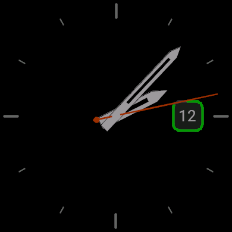
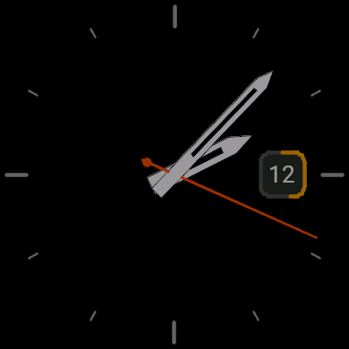
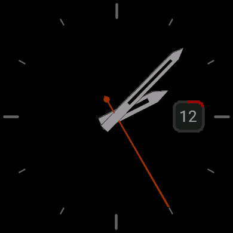
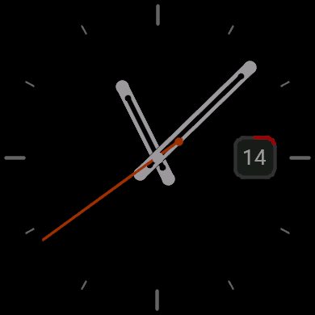
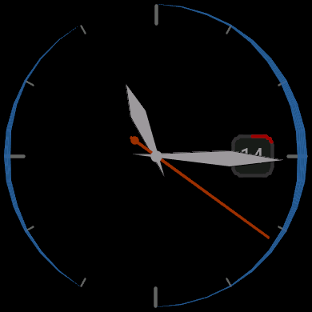
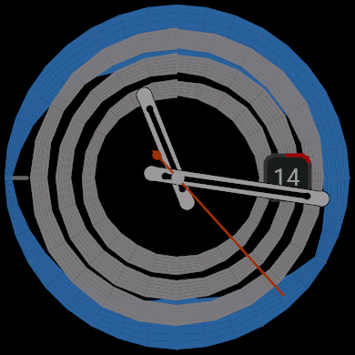
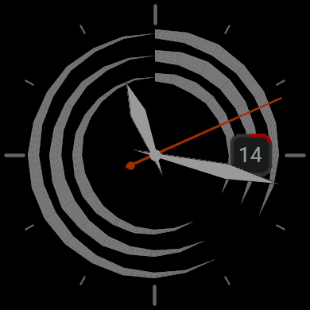

# analog-simple

A configurable analog watch face for the Garmin Venu 4 (41mm), built with
the Connect IQ SDK.

| 85% — green | 45% — yellow | 15% — red |
| --- | --- | --- |
|  |  |  |

*The battery ring around the date box changes color with the remaining
level. Shown with the default Sword hands (parallel blades with a
transparent lume channel) at 60% color brightness.*

| Clear | Light rain | Heavy rain + cloud | Cloudy |
| --- | --- | --- | --- |
|  |  |  |  |

*The blue band hugs the bezel and deepens with rain; the grey lines float
inward from the bezel and thicken with low/mid/high cloud cover. Shown with
the Rounded Lume and Diamond hand styles.*

## Features

- Analog hour/minute/second hands with a choice of four hand styles:
  Classic, Sword (with a transparent lume inset), Diamond, and Rounded Lume
  (the default — a capsule shape with a hollow lume channel).
- Adjustable hand length (80-110%).
- 12 hour tick marks around the bezel (configurable color).
- An optional 12-hour **rain-amount forecast** drawn as a blue gradient band
  around the bezel (12 o'clock = soonest hour, clockwise); the band hugs the
  rim and deepens with that hour's precipitation in mm — nothing is drawn
  for dry hours.
- An optional **cloud cover** display: three grey gradient lines (low, mid,
  high altitude) floating inward from the bezel — higher cloud sits closer
  to the centre, and each line thickens with that layer's coverage.
- Both forecasts are fetched in the background from
  [Open-Meteo](https://open-meteo.com/) (ECMWF model) and need the watch's
  location (or a manual lat/long override) plus a phone connection to
  refresh.
- A dark grey date box at the 3 o'clock position showing the day of month.
- A rounded-square progress ring around the date box that shows either your
  current **Body Battery** level or your **Watch Battery** level remaining
  (0-100%). The ring can either be a fixed color or automatically colored
  green/yellow/red based on the level, with an optional **Colorblind Mode**
  that switches to a red-green-safe red/amber/blue scale.
- A color brightness setting (100/80/60/40%) that mutes every drawn color —
  dimmer pixels also draw less power on the AMOLED display.

## Project layout

- `manifest.xml` - app manifest (targets `venu441mm`).
- `monkey.jungle` - build configuration.
- `source/AnalogSimpleApp.mc` - application entry point.
- `source/AnalogSimpleView.mc` - watch face drawing logic.
- `resources/settings/` - user-configurable properties (`properties.xml`)
  and the settings UI shown in Garmin Connect/Express (`settings.xml`).
- `resources/strings/` - localized strings.
- `resources/drawables/` - launcher icon.

## Settings

All settings are configurable from the Garmin Connect or Garmin Express
app after installing the watch face:

| Setting | Description |
| --- | --- |
| Hand Style | Rounded Lume (default), Classic, Sword, or Diamond hand shapes |
| Hand Length | Short (80%) to Long (110%) |
| Show Second Hand | Toggle the second hand |
| Color Brightness | Mute all colors to 80/60/40% for a softer, lower-power face |
| Tick Mark Color | Color of the bezel hour ticks |
| Rain Forecast | Show the next 12 hours of rain amount as a blue gradient band around the bezel (Open-Meteo) |
| Cloud Cover | Show low/mid/high cloud cover as three grey gradient lines (Open-Meteo) |
| Location Override | Force the weather location to a "latitude,longitude" pair instead of GPS |
| Date Color | Color of the day number |
| Battery Ring Source | Body Battery or Watch Battery |
| Color Ring By Level | Auto-color the ring green/yellow/red by level |
| Colorblind Mode | Use a red-green-safe red/amber/blue ring scale |
| Ring Color | Fixed ring color (used when "Color Ring By Level" is off) |

## Building

Requires the [Connect IQ SDK](https://developer.garmin.com/connect-iq/sdk/)
and a developer key. From this directory:

```sh
monkeyc -f monkey.jungle -d venu441mm -o bin/analog-simple.prg -y developer_key
```

Then run it in the simulator:

```sh
connectiq
monkeydo bin/analog-simple.prg venu441mm
```
